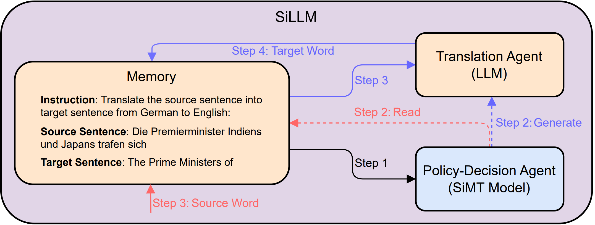

# SiLLM

Source code for our paper "SiLLM: Large Language Models for Simultaneous Machine Translation".

<div style="text-align:center;">
  
</div>

The framework of SiLLM incorporates the LLM to achieve the Simultaneous Machine Translation. It generates the translations under the guidance of the policy decided by the conventional Simultaneous Machine Translation Model.

Our method is implemented based on the open-source toolkit [Alpaca-LoRA](https://github.com/tloen/alpaca-lora).

## Requirements and Installation

* Python version = 3.8

* PyTorch version = 2.2

* Install our library:

```
git clone https://github.com/ictnlp/SiLLM.git
cd SiLLM
pip install -r requirements.txt
```

## Quick Start

### Fine-tune

We sample 100k data for fine-tuning LLM from WMT15 German-English (download [here](https://www.statmt.org/wmt15)) and MuST-C English-German (download [here](https://mt.fbk.eu/must-c/)), respectively. In the given example, we sample only 50k of data to provide the data format.


We perform SFT for WMT15 German-English dataset using the script:
```
bash finetune.sh
```

### Wait-k-SiLLM
We can execute the Wait-k policy with LLM by running the following script:
```
bash Wait-k-SiLLM.sh
```


### HMT-SiLLM
We can execute the HMT policy with LLM and get the outputs by running the following script:
```
bash HMT-SiLLM.sh
```


## Citation
```
@misc{guo2024sillm,
      title={SiLLM: Large Language Models for Simultaneous Machine Translation}, 
      author={Shoutao Guo and Shaolei Zhang and Zhengrui Ma and Min Zhang and Yang Feng},
      year={2024},
      eprint={2402.13036},
      archivePrefix={arXiv},
      primaryClass={cs.CL}
}
```
